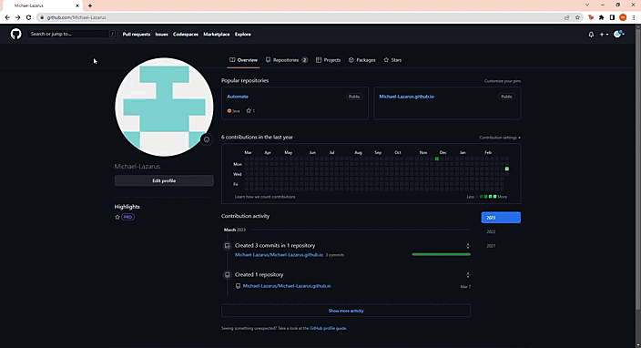
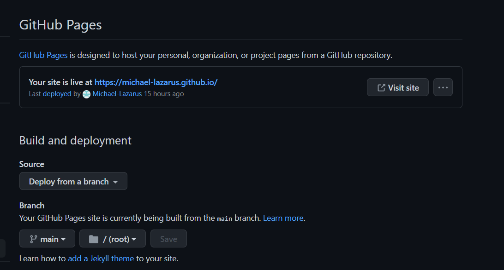

# Comp 3040. Assignment 2
# How to host a resume on Github Pages with Windows


Audience: CS Student
Venue: README on Github Pages
Purpose: Explain how to host a resume on Github Pages.
Additional purpose: Introduce and demonstrate the principles of Andrew Etter's
book Modern Technical Writing
Desired Reaction: Informed
Vocabulary: semi-formal
Tone: clear

## Table of Contents:
- [Comp 3040. Assignment 2](#comp-3040-assignment-2)
- [How to host a resume on Github Pages with Windows](#how-to-host-a-resume-on-github-pages-with-windows)
  - [Table of Contents:](#table-of-contents)
  - [Purpose](#purpose)
  - [Prerequisites](#prerequisites)
  - [Instructions](#instructions)
    - [Step 1: Create a Github account](#step-1-create-a-github-account)
    - [Step 2: Create a new repository](#step-2-create-a-new-repository)
    - [Step 3: Clone your repository](#step-3-clone-your-repository)
    - [Step 4: Formatting your resume](#step-4-formatting-your-resume)
    - [Step 5: Launch a static site](#step-5-launch-a-static-site)
    - [Step 6: Send your resume off to GitHub](#step-6-send-your-resume-off-to-github)
    - [Step 7: Enable GitHub Pages](#step-7-enable-github-pages)
    - [Step 8: View Your Resume](#step-8-view-your-resume)
  - [More resources](#more-resources)
  - [FAQs](#faqs)


## Purpose
Have an understanding of how to properly host a resume on GitHub Pages while also relating the instructions to the concepts discussed in Modern Technical Writing.

## Prerequisites
Before starting, we should minimally have a resume, some markdown, Git and, Jekyll skills (Please visit the [More resources](#more-resources) sections for tutorials). Additionally, we would need to have the following tools installed:
 * [VS Code](https://code.visualstudio.com/download) 
  * [Jekyll](https://jekyllrb.com/docs/installation/windows/)


## Instructions

### Step 1: Create a Github account
In order to publish sites on GitHub Pages, you will first off need a GitHub account. You can make one by simply visiting the [GitHub site](https://github.com/).

### Step 2: Create a new repository
We now want to make a new repository to host our resume. You can do so by following the instructions below:

1. Create a new repository by clicking the **"+"** sign at the to left corner and selecting **"New repository"**.
  
1. Next, set your repository name as username.github.io. Basically, if the username for our account is Mike, we should have our repository name set as Mike.github.io (Note that the username is case sensitive).
2. The repository is set to public by default, that's what we want (there's no need for a resume website no one can access). Finally, hit the **"Create repository"** button at the bottom.

### Step 3: Clone your repository
Once we have finished creating a git repository, we now want to clone the repository into our local machine (laptop or desktop). If you do not have a file where you plan to work from, this is the perfect chance to make one. This is going to require some terminal work. While working on a terminal might seem scary at first, once you get a hang of it, you'll probably always have it on at the background (I totally don't just leave mine open to look like a cool programmer that knows what they are doing 🤥).Once you have the file you plan to use, open it and prepare to take your first step into the magical world of Git (queue fireworks!)🎆:

1. Once in the folder, right click anywhere in the folder and click the **open in terminal** option.
2. This opens up a terminal with the file path. Now you will want to go back to your Git repository, yes it's empty right now and that is what we want. in the **Quick Setup** box we are given options for how to setup, copy the http link in the dialog box. 
3. Go back to your terminal window and type in:
   ``` bash
    git clone <paste> #Replace <paste> with the link you copied from GitHub (You can do this by left clicking on your mouse) 
    ```
4. You might get an empty repository warning but we have successfully completed our first git command in one line!
5. You can then add in your resume and readme files into the folder and update your GitHub by using the push command.
   ``` bash
   git push -u origin main #Use this command the first time you are pushing to the repository
   git push #You can use this for subsequent pushes (Only works after you set up the origin using the command above)
   ``` 
6. You might be asked to set up an email and username for the system to recognize you, follow the prompts on the screen to complete the verification 
7. Now we have successfully cloned a repository!
   
### Step 4: Formatting your resume
At this point you have either gone through the markdown tutorial in the prerequisites or had already had markdown editing skills, great! Now to complete this step, format your resume into a markdown file using VS Code or any other Markdown editor of your choice. The reason we should have a markdown formatted resume is that in Modern Technical Writing, Etter recommends that we should use a structured approach to documentation, which means using consistent formatting and clear, concise language. Another reason is that Etter advices us to use a lightweight markup language for the fact that it is easy to read and convert to other forms. We will use this markdown file to generate our website (So we basically don't need to write a lick of HTML/JavaScript 🎉).

### Step 5: Launch a static site
Another step that Etter recommends in their book is to use a static site, as it has a wide usability range, its easy to maintain and efficient. for thatreason, we are going to use it for our resume site. Repeat step [3.1](#step-3-clone-your-repository) in the file location we are working from. Then use run the code below in the terminal:

```bash
jekyll new NewWebFile #you can replace the last argument in the command with anything you want to name the file
cd NewWebFile #We are basically going into the file we just made
bundle exec jekyll serve #Now we are compiling the website using jekyll
```
This basically runs in your terminal till you press ctrl+c. However, while it is running we can access our local static site on our browser from [here](http://localhost:4000). To have your resume shown in the homepage, you can basically copy and paste your markdown resume content into the index.md (or might show up as index.markdown) file. Now we have a fully functional static site.

### Step 6: Send your resume off to GitHub
Now take a deep breath, you done great reaching this point, now we're almost ready to show off our fancy resume website to the world. If you made any updates to your resume since our last push, you can now send them up using the following commands.
``` bash
git add . #This command adds all new files in the folder to be pushed
git commit -m "Adding updated resume" #Can be any message but this command adds a message to let us know the details about this 
git push
```
### Step 7: Enable GitHub Pages
Start by going to the "Settings" tab in your repository and scroll down to the __Pages__ section. Make sure it is set to the main branch, and click "Save".


### Step 8: View Your Resume 
Your resume should now be hosted at https://<your-github-username>.github.io/resume/. It may take a few minutes for your changes to appear.

## More resources
- [Modern Technical Writing](https://www.amazon.ca/gp/product/B01A2QL9SS/ref=kinw_myk_ro_title)
- [Resume building](https://umanitoba.ca/career-services/employment-resources-students#marketing-yourself)
- [Markdown tutorial](https://www.markdowntutorial.com/)
- [Jekyll tutorial](https://www.mikedane.com/static-site-generators/jekyll/)
- [Git](https://rogerdudler.github.io/git-guide/)

## FAQs 
* Why is Markdown better than a word processor?

    - Markdown is a lightweight markup language that is easy to learn and use. It allows you to create structured documents without the overhead of a full-fledged word processor. Additionally, Markdown files can be easily version-controlled and shared on platforms like GitHub.

* Why is my resume not showing up?

    - Make sure that you have enabled GitHub Pages in your repository settings (the page should show that your site is live) and that you have pushed your files to the main branch.

    

* How do I make my resume the landing page

    - We can do this by renaming your resume file to index.md!
  
